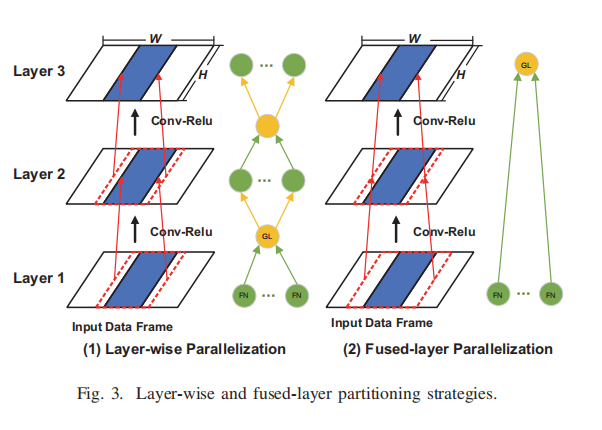

# Report: Learning-Based Non-Linear Erasure Code for Distributed Inference

## Abstract

本项目的目标是在复现论文 Learning-Based Coded Computation 的研究结果的基础上，探究基于学习的编码计算框架的可拓展性。上述论文通过将机器学习结合到编码计算上，探索了基于学习的编码计算在非线性计算上的弹性。我们将在其研究基础上，探究该编码计算框架性能提升的可能性，并进一步着重探索其分布式潜能。我们将主要关注图像分类问题，尝试采用分布式方法改造此框架的数据流与网络结构，探究基于学习的编码计算减小硬件依赖并提升计算性能与准确性的可能性，使神经网络推断结果发生部分不可用情况时，更高效和准确地恢复神经网络的推断结果。

## Background

分布式学习在机器学习中使用分布式技术，让多个计算节点协同合作以完成一个学习或推断任务。在分布式学习中，数据和计算任务被分散到多个计算节点中，每个节点独立地处理一部分数据，并通过通信和协调来共同学习模型参数或完成推断。这种方法通常用于大规模数据集或需要大量计算资源的机器学习任务（例如深度学习）。分布式学习可以加速模型训练，提高性能，并允许处理大量数据，同时减少单个计算节点的负担。

编码计算是一种支持容错性的计算方法，通常用于分布式系统中。在编码计算中，数据被分割成多块，进行编码以创建冗余数据块，以便在数据发生不可用（Unavailable）时能够恢复原始数据。这种编码技术通常被称为纠删码（Erasure Coding）或容错编码（Error-Correcting Code）。通过编码计算，数据的安全性和可靠性可以得到提高，而且可以降低数据存储和传输的成本。

人工智能在近年来的发展推动了网络边缘的智能应用。在此场景中，分布式技术成为一种能够提升计算安全性和处理效率的良好手段。由于在常见的分布式计算环境中，各边缘设备在计算能力、硬件资源、网络状况、设备架构等方面存在异构性（Heterogeneity），使得分布式推断容易出现不可用性（Unavailability），导致延迟。编码计算最近作为一种潜在的方法重新焕发活力，可以减轻此类系统中速度缓慢和故障的影响，同时使用比基于复制的方法更少的资源[^r1]。然而，传统的编码计算存在可拓展性受限的情况，因此引发了一个问题：能否考虑将分布式学习结合到编码计算，为其提供更广泛的扩展性？

[^r1]: K. Lee, M. Lam, R. Pedarsani, D. Papailiopoulos, and K. Ramchandran, “Speeding up distributed machine learning using codes,” *IEEE Trans. Inf. Theory*, vol. 64, no. 3, pp. 1514–1529, Mar. 2018.

## Related Work

### I. Learning Based Coded Computation

#### Paper: Learning-Based Coded Computation[^LBCC]

[^LBCC]: J. Kosaian, K. V. Rashmi, and S. Venkataraman, “Learning-Based Coded Computation,” May. 2020.

+ **Introduction**

  该论文发表于2020年，首次将机器学习应用到编码计算领域。
  
  该论文指出：编码计算具有增强抵御分布式计算系统中发生的减速和故障的能力的潜力。 然而，**现有的编码计算方法在非线性计算方面支持性很低。**在此背景上，他们提出了一种基于学习的编码计算框架，以克服对一般非线性函数执行编码计算的挑战。结果表明：a. 在编码计算框架内使用机器学习可以扩展编码计算的范围，从而为更一般的非线性计算提供弹性。b. 基于学习的编码计算能够准确重建广泛部署的神经网络无法获得的结果，用于图像分类、语音识别和对象定位等各种推理任务。

+ **Traditional Coded Computation *vs* Learning-Based Coded Computation**

  常见的分布式计算环境容易出现**不可用性**（例如速度减慢和故障），导致延迟。对于这种不可用性， 编码计算赋予了新的弹性：**通过传统编码计算，用于计算的输入被首先编码，在计算完成后，如果输出出现部分不可用的情况，编码计算能够借助编码输入恢复出输出中不可用的部分，以此提升分布式计算的性能。**

  然而，传统编码计算的研究集中在线性计算上。它们要么无法支持非线性计算，要么只能支持有限的非线性计算子集，同时需要较高的资源开销。这极大地限制了编码计算可以投入的应用场景。因此，虽然编码计算是一种有前途的缓解速度减慢和故障的技术，但传统编码计算不足以为更广泛的非线性计算提供弹性。

  许多机器学习模型都是复杂的非线性函数。机器学习近期在复杂任务（例如图像分类和自然语言处理）方面取得的进展表明出它在帮助克服非线性函数编码计算方面的潜力。在此背景下，该论文做出了以下工作：**提出了一个基于学习的编码计算框架，通过使用神经网络作为编码器和解码器来学习对非线性函数进行编码计算，进而有效重建出了不可用的输出。**

+ **Architecture**

  该项目框架如下。考虑以下推理任务：存在一个推理函数 $\mathcal F$，称之为【基本模型】，在若干设备上各自存在其副本。给定 $k$ 个输入 $X_1, X_2, ... , X_k$ ，目标是计算 $\mathcal F(X_1), \mathcal F(X_2), ... , \mathcal F(X_k)$ 。编码器 $\mathcal E$接收 $k$ 个原始输入 $X_1, X_2, ... , X_k$ ，产生 $r$ 个校验输入 $P_1, P_2, ... , P_r$ 。随后将这所有的 $(k+r)$ 个原始和校验输入都发送到 $\mathcal F$ 的副本，各自计算出相应结果。最后，在至多 $r$ 个输出结果不可用（缓慢或失败）的情况下，恢复出所有的 $k$ 个输出 $\mathcal F(X_1), \mathcal F(X_2), ... , \mathcal F(X_k)$ 。

  在实际操作中， 基本模型 *F* 是一个用于图像分类的神经网络，且该论文的工作模拟了k=2且r=1的情况。

  

### II. Distribution Strategies in DNN

#### Paper: EdgeLD: Locally Distributed Deep Learning Inference on Edge Device Clusters [^EdgeLD]

[^EdgeLD]: F. Xue, W. Fang, W. Xu, etc, “EdgeLD: Locally Distributed Deep Learning Inference on Edge Device Clusters,” 2020.

+ **Introduction**

  在边缘智能应用场景下，由于边缘设备难以负担传统DNN较大的计算和内存负担，故实现分布式DNN具有一定合理性。本篇论文实现了一个基于DNN的分布式推断框架【EdgeLD】，通过分割卷积网的计算量到多设备实现分布式推断，在普通的 layer-wise 模式的基础上，采用层融合（layer fusion）实现优化，来减少设备之间交换中间数据的通信开销。此外，在任务分配上，该论文提出了一个模型分割算法（model partition scheme），以平衡模型的工作量和运行时间。
  
+ **Methods**

  + 常见模型分割方法的不足
  
    由于DNN大量的资源消耗，会造成资源紧张的问题。以往用来解决此问题的常用方法是模型压缩（Model Compression）和云卸载（Cloud Offloading）。在模型压缩中，有权重修剪、知识蒸馏等具体方法，它们会提升模型的处理效率，但会造成原模型设计复杂性和精确性的缺失。[^r2]  在云卸载中，用DNN进行计算的工作量被根据执行顺序进行解耦，并将计算密集型的工作分配到强大的云端服务器上，但此类技术可能由于不稳定的网络连接而导致传输延迟过长。[^r3]  考虑到以上方法的不足之处，该论文提出了新的模型分割法。

  + 设备分工
  
    设备的集群中，节点分为两类： GL（Group leader）和 FNs（Follower nodes）。GL节点负责计算工作量的分配，并将任务发配到若干 FNs 节点上。各节点分别独立计算，再将结果汇总到 GL 节点。
    
  + 分割卷积层任务量
  
    由于卷积层占据了大部分的运算资源和耗时，故考虑分割卷积层的计算任务量到分布式系统中的节点设备。该论文提出了 One-dimensional Computation&Bandwidth-based Partition （OCBP）。相较于以往的 Biased One-Dimensional Partition （BODP）[^r4]，这种分割算法（OCBP）同时考虑了异构节点的计算资源和网络条件，
    
  + 跨设备数据交互与融合层
  
    该论文采用了一种 layer-wise 的并行计算模式，每个 FN 节点只计算与自己相关的部分任务量，再汇集到 GL 。但这样带来的设备间通信会降低性能。因此，该论文同时采用 fused-layer 方式来改善这种情况。在这种方式中，连续的卷积层被打包成**融合块（fused block）**，作为一个整体进行计算，而不用再在不同层间进行跨设备的数据交互，只在融合块的输入输出端进行数据的跨设备传输。能够这样做的原因在于卷积层具有逐层间数据依照位置具有对应关系的天性：**每一层的结果来源于其上层的对应点及周围点，因此可以将与某层内某位置有关的计算向上进行映射。** 
  
    

[^r2]:  J. Mao, X. Chen, K. W. Nixon, C. Krieger, and Y. Chen, “Modnn: Local distributed mobile computing system for deep neural network,” in Design, Automation Test in Europe Conference Exhibition (DATE), 2017, 2017, pp. 1396–1401.
[^r3]:  J. Mao, Z. Yang, W. Wen, C. Wu, L. Song, K. W. Nixon, X. Chen, H. Li, and Y. Chen, “Mednn: A distributed mobile system with enhanced partition and deployment for large-scale dnns,” in 2017 IEEE/ACM International Conference on Computer-Aided Design (ICCAD), 2017, pp. 751–756.
[^r4]:  J. Mao, X. Chen, K. W. Nixon, C. Krieger, and Y. Chen, “Modnn: Local distributed mobile computing system for deep neural network,” in Design, Automation Test in Europe Conference Exhibition (DATE), 2017, 2017, pp. 1396–1401.

#### Paper: Adaptive Parallel Execution of Deep Neural Networks on Heterogeneous Edge Devices[^Adaptive]

[^Adaptive]:  L. Zhou, M. H. Samavatian, A. Bacha, etc, “Adaptive Parallel Execution of Deep Neural Networks on Heterogeneous Edge Devices,” Sept. 2019.

+ **Introduction**

  在分布式推断中，对网络结构和任务量的分割往往会显著影响分布式推断效果。在此背景下，本篇论文总结了两种对卷积层任务量的分割方法，以及两种实施并行计算的策略，并充分分析了这些不同方法和策略间的权衡，进一步提出了一个运行时自适应的CNN加速框架。该框架考虑了设备资源可访问性、网络条件等因素，实现了进行任务量分配的动态算法。通过融合卷积层和动态选择并行度，减少了通讯代价，提高了一定速度。

+ **Methods**

  + 对卷积层计算量的分割方法
  
    分割卷积层计算量时可以按频道分割（Channel partitioning）或按空间分割（Spatial partitioning）。
    
    在按频道分割中，卷积层中每个过滤器会生成一个特征图（Feature map），这些特征图可以沿通道维度进行分区，映射到对应设备，这样每个设备就只需计算特征图的一个子集。在这种分割模式中，与同步网络参数（synchronizing network parameters）相关的通讯代价能够被降低（这在模型训练时很有效），但输入图需要完整复制到所有设备上，由此带来的额外通讯代价往往导致它在执行推断任务时相比按空间分割更不实用。
    
    按空间分割以空间为划分依据，按长宽分割出特征图（Feature map），分配给多个节点。在这种分割模式中，每个节点只需要接受输入图的一部分，而在每个设备中都有完整的神经网络。由于在卷积层中，与某层某位置相关的计算能够进行向上映射，故输入的分区并不是完全不相交的，这使得按空间分割的方法需要考虑由此产生的冗余计算问题和设备间数据交互问题。
    
    
    
  + 在并行计算中的权衡
  
    实施并行计算有以下两种策略：逐层并行（Layer-wise）或融合层并行（Fused-layer）。
    
    在逐层并行策略中，每层的计算会根据其层类型、特征图形状、过滤器大小等具体情况而定，因而每一层会被依据自身情况单独并行，每并行计算完一层的结果时需要合并各节点的计算结果作为此层的计算结果，在根据下一层的情况进行分割，进而开始下一层的并行计算。这种并行策略意味着需要有一个主机节点负责进行并行计算任务的不断发配与回收。
    
    在融合层并行策略中，若干连续的卷积层被打包成一个融合块，作为一个整体参与并行计算，与 EdgeLD 中的情况类似。[^EdgeLD]  在融合块内部，上一层的输出被直接发送到下一层对应位置的输入，而无需频繁地进行任务量的发配与回收，故避免了由此产生的设备通信开销。但是，由于卷积层计算任务向上映射的特性，输入分区有一定程度的重叠，这又会造成额外的冗余计算量。**当融合层中的层数越多，它能够减小的通信开销越多，而由于输入分区重叠产生的冗余计算的成本也越高。**

    

#### Some Other Work

除了以上的两篇论文，还有一些其他关于分布式策略的方法被提出。**它们的一个显著共同点是都着重关注了分布式计算中对任务量尤其是卷积层计算量的分割**，并且基本可以归纳为两个方面：a. 从神经网络结构以及数据流的角度进行的分割方法，b. 考虑设备异构性而从节点运算条件角度进行的分割算法。

在从神经网络结构以及数据流的角度进行的分割方法方面，考虑到卷积层占据的大部分计算量，很多方法从优化卷积层的角度入手，在逐层并行计算的基础上，进行一定程度的融合层并行计算，并在实际情况中仔细探究了这种方法在提升计算性能上的权衡与取舍。[^EdgeLD]  [^Adaptive]

在考虑设备异构性而从节点运算条件角度进行的分割算法方面，大多数方法将节点划分为主从两个类别。其中，主机节点负责进行任务量的总体调控，通过各种算法实现任务量的合理分配，再与各跟从节点一同完成分布式计算任务。除了考虑设备算力资源和网络条件的动态任务量分配算法之外，还有一些其他算法被提出。例如：运行一个 device profiling 算法评估设备算力资源，再将各节点的运行结果汇集到分析引擎上生成分割计划[^CoEdge]；又如：通过一个 work stealing 的算法，在运行中让计算资源有剩余的节点去截取计算资源紧张的节点的计算任务量[^DeepThings]，等等。

[^CoEdge]: J. Zhang, L. Yang, Z. Zhou, etc, “CoEdge: Cooperative DNN Inference With Adaptive Workload Partitioning Over Heterogeneous Edge Devices,” April. 2021.
[^DeepThings]: A. Gerstlauer, Z. Zhao, K. M. Barijough, “DeepThings: Distributed Adaptive Deep Learning Inference on Resource-Constrained IoT Edge Clusters,” November. 2018

## Proposal

已完成的工作：

参考论文 Learning-Based Coded Computation 提供的代码仓库，通过使用其开源代码，我们已经成功复现了论文中的基于学习的编码计算过程及结果。

给定神经网络结构及结果分割数量，计算出输入的分割方式。

后续主要工作：

构建如下图所示的分布式神经网络

